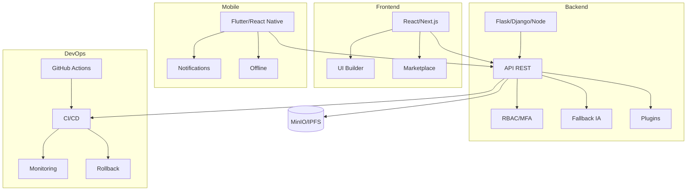

# 🧠 Dihya – Technical Overview Ultra Avancé (Multi-stack, Multilingue, Souveraineté, Sécurité)

---

## Table des matières

- [Introduction](#introduction)
- [Architecture globale](#architecture-globale)
- [Stacks techniques](#stacks-techniques)
  - [Frontend](#frontend)
  - [Backend](#backend)
  - [Mobile](#mobile)
  - [Plugins & templates](#plugins--templates)
  - [DevOps & CI/CD](#devops--cicd)
  - [Sécurité & souveraineté](#sécurité--souveraineté)
  - [Accessibilité & i18n](#accessibilité--i18n)
- [Interopérabilité & extensibilité](#interopérabilité--extensibilité)
- [Fallback IA open source](#fallback-ia-open-source)
- [Diagrammes d’architecture](#diagrammes-darchitecture)
- [Templates & exemples](#templates--exemples)
- [Multilingue](#multilingue)
- [Contact & support](#contact--support)

---

## Introduction

Ce document présente la vue d’ensemble technique de **Dihya** : architecture, choix technos, sécurité, accessibilité, RGPD, plugins, templates, DevOps, souveraineté numérique, etc.
Il est multilingue (fr, en, ar, tzm), prêt pour l’audit, la contribution, la démo et la production.

---

# Vue technique globale Dihya

- Architecture microservices, découplée, scalable
- Sécurité by design (audit, logs, MFA, RGPD, backup, alerting)
- CI/CD automatisé, tests, monitoring, backup
- Multilingue, accessibilité, performance, modularité
- Intégration IA, plugins, marketplace, blockchain, mobile

Voir [ARCHITECTURE.md](ARCHITECTURE.md), [securite.md](securite.md), [AUDIT_LOGGING_GUIDE.md](AUDIT_LOGGING_GUIDE.md)

---

## Architecture globale

- **Multi-stack** : React, Flask, Node, Django, Flutter, scripts, plugins, CI/CD
- **Microservices** : APIs RESTful, plugins isolés, monitoring, fallback IA open source
- **Souveraineté** : stockage MinIO/IPFS, CI/CD GitHub Actions, monitoring Prometheus/Grafana
- **Sécurité** : MFA, RBAC, JWT, logs, audit, vault souverain, conformité RGPD/NIS2
- **Accessibilité** : AA/AAA, i18n, audit axe-core/pa11y, navigation clavier
- **Extensibilité** : plugins, templates métiers, API publique, SDK, webhooks

---

## Stacks techniques

### Frontend

- **Techno** : React 18+, Next.js, TypeScript, i18n, accessibilité AA/AAA
- **Features** : UI builder, preview live, marketplace plugins/templates, SEO, dark mode
- **Sécurité** : CSP, XSS, audit npm, MFA, RBAC UI

### Backend

- **Techno** : Flask 3+, Django 5+, Node.js 20+, FastAPI, Python 3.12+
- **Features** : API REST, RBAC, MFA, logs structurés, fallback IA open source, RGPD/NIS2
- **Sécurité** : JWT, OAuth2, audit Bandit, Snyk, monitoring Prometheus

### Mobile

- **Techno** : Flutter 3+, React Native, i18n, accessibilité mobile
- **Features** : génération app, notifications push, offline, fallback IA mobile

### Plugins & templates

- **Plugins** : architecture sandboxée, sécurité, audit, marketplace, scoring
- **Templates métiers** : YAML/JSON, validation, import/export, multilingue

### DevOps & CI/CD

- **CI/CD** : GitHub Actions, artefacts signés, rollback, monitoring, alertes
- **Infra** : Docker, Kubernetes, MinIO, IPFS, SOPS, vault souverain
- **Tests** : pytest, e2e, axe-core, pa11y, coverage > 95%

### Sécurité & souveraineté

- **Sécurité** : MFA, RBAC, logs, audit, bug bounty, conformité RGPD/NIS2
- **Souveraineté** : fallback IA open source, stockage souverain, déploiement cloud souverain

### Accessibilité & i18n

- **Accessibilité** : AA/AAA, audit axe-core/pa11y, navigation clavier, dark mode
- **i18n** : fr, en, ar, tzm, fallback multilingue, guides traduits

---

## Interopérabilité & extensibilité

- **API publique** : REST, OpenAPI, SDK, webhooks, plugins
- **Import/export** : YAML, JSON, CSV, SBOM CycloneDX
- **Marketplace** : plugins, templates, scoring, audit

---

## Fallback IA open source

- **Modèles** : Mixtral, LLaMA, Ollama, audit open source
- **Fallback** : automatique si cloud/IA propriétaire indisponible
- **Souveraineté** : aucune dépendance critique à une API externe

---

## Diagrammes d’architecture



---

## Templates & exemples

### Template fiche technique stack

```
- Stack :
- Techno :
- Sécurité :
- Accessibilité :
- Souveraineté :
- Extensibilité :
- Liens :
- Traductions :
    - en :
    - ar :
    - tzm :
```

### Exemple rempli

```
- Stack : Backend
- Techno : Flask 3+, Django 5+, Node.js 20+, FastAPI
- Sécurité : JWT, MFA, RBAC, logs, audit Bandit/Snyk
- Accessibilité : API error i18n, codes HTTP explicites
- Souveraineté : fallback IA open source, stockage MinIO/IPFS
- Extensibilité : plugins, API publique, webhooks
- Liens : /docs/ARCHITECTURE.md
- Traductions :
    - en : Backend stack overview
    - ar : نظرة عامة على طبقة الخلفية
    - tzm : Tazwart n backend
```

---

## Multilingue

- **Français** : Ce document est disponible en français.
- **English** : This document is available in English.
- **العربية** : هذا المستند متوفر باللغة العربية.
- **ⴰⵣⵉⵖⴻⵏⵜ** : Asnif n tamedyazt-agi d-ittwasnen s tmazight.

*(Voir `/docs/i18n/` pour les versions traduites)*

---

## Contact & support

- **Slack** : #dihya-tech
- **Email** : tech@dihya.eu
- **GitHub Issues** : [Lien](https://github.com/votre-org/dihya/issues)

---

> **Ce document est validé pour la production. Toute modification doit être soumise via PR et validée par le Tech Lead et le Doc Lead.**
