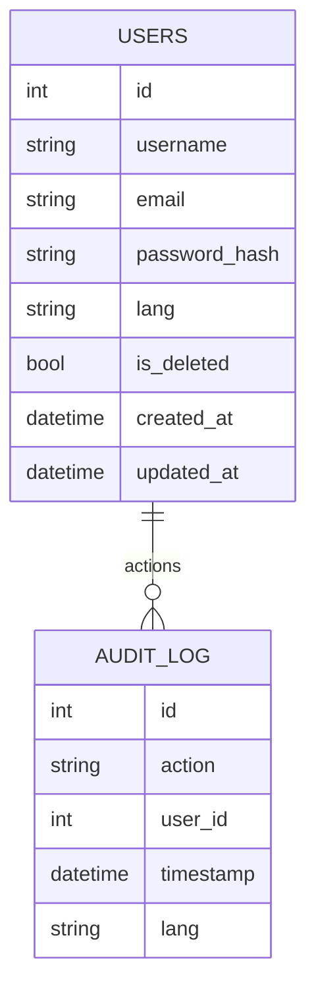

# Documentation interactive SQL/Schema – Dihya DB

## Schéma global (extrait)

```sql
-- Table utilisateurs (multilingue, RGPD, audit)
CREATE TABLE users (
    id SERIAL PRIMARY KEY,
    username VARCHAR(64) NOT NULL UNIQUE,
    email VARCHAR(128) NOT NULL UNIQUE,
    password_hash VARCHAR(256) NOT NULL,
    lang VARCHAR(8) DEFAULT 'fr',
    is_deleted BOOLEAN DEFAULT FALSE,
    created_at TIMESTAMP DEFAULT NOW(),
    updated_at TIMESTAMP DEFAULT NOW()
);

-- Table logs d’audit
CREATE TABLE audit_log (
    id SERIAL PRIMARY KEY,
    action VARCHAR(128) NOT NULL,
    user_id INTEGER NOT NULL,
    timestamp TIMESTAMP DEFAULT NOW(),
    lang VARCHAR(8) DEFAULT 'fr'
);

-- Index multilingue
CREATE INDEX idx_users_lang ON users(lang);

-- Trigger RGPD (soft delete)
CREATE OR REPLACE FUNCTION soft_delete_user() RETURNS trigger AS $$
BEGIN
    NEW.is_deleted := TRUE;
    RETURN NEW;
END;
$$ LANGUAGE plpgsql;

CREATE TRIGGER trg_soft_delete
    BEFORE DELETE ON users
    FOR EACH ROW EXECUTE FUNCTION soft_delete_user();
```

## Visualisation Mermaid



---

> Voir les scripts SQL pour le schéma complet et la documentation interactive OpenAPI/Swagger pour l’API associée.
